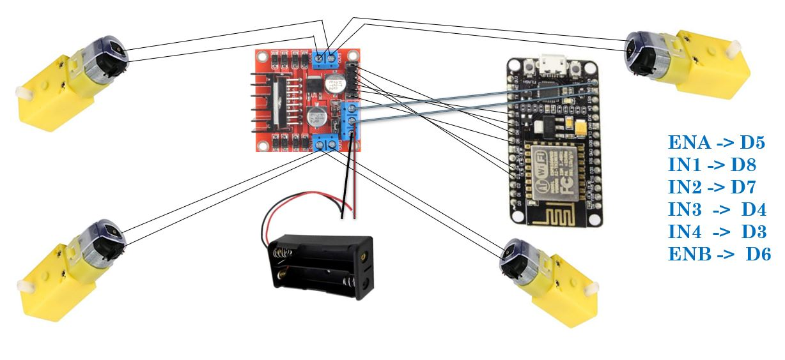
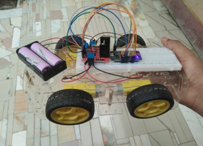
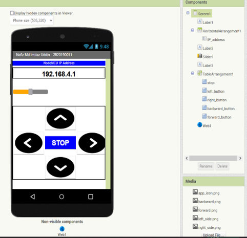
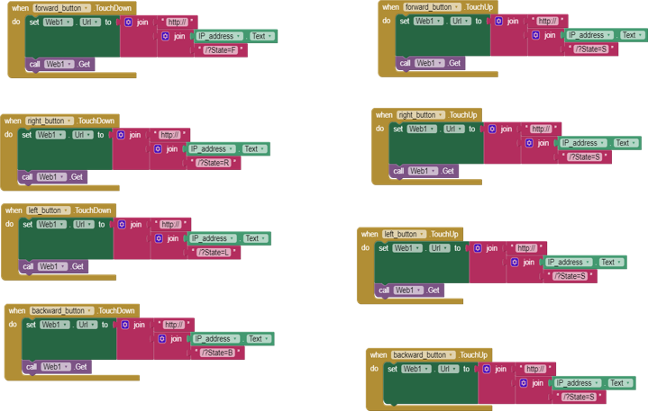
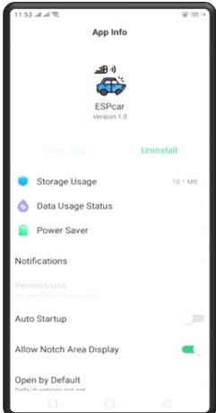
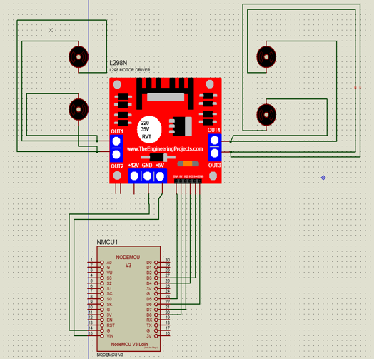
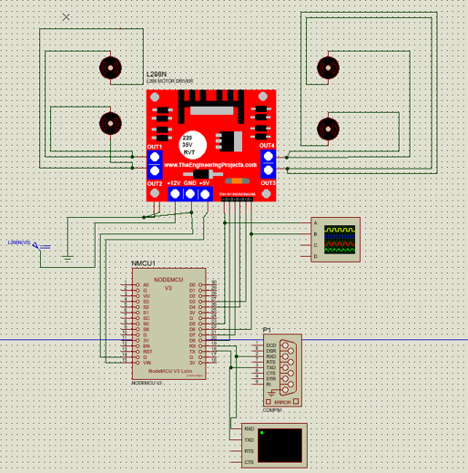

# <b>Controlling and observing a robotic car with a smartphone through NodeMCU</b>

## [See more details...](https://www.slideshare.net/ImtiazMohammad5/nodemcu-controlliing-and-observing-car-project)

_The NodeMCU board communicates to the MIT app cloud through WiFi when the WIFI-controlled automobile is turned on. The data will be communicated to the NodeMCU board through the cloud when hit the Commands (Forward, Backward, Left, Right) buttons on the interface built in the MIT app. The gear motors then rotate in accordance with those values. This is done with the L298N motor driver board. The speed of these motors may also be changed via the MIT app's slider._

### USES FOR THIS HARDWARE PROJECT
- NodeMCU (ESP-12E) x 1 + USB data cable,
- L298N motor driver x 1, 
- Gear motor x 4, 
- Robot wheel x 4,
- Battery holder (2 pics 3.7V battery),
- Jumper wires,
- Breadboard  x 1,
- Chassis board x 2, 
- Screws + Screw driver,
- Others.

### CIRCUIT DIAGRAM

### Here is inclued some pictures:

## [See more details...](https://www.slideshare.net/ImtiazMohammad5/nodemcu-controlliing-and-observing-car-project)
